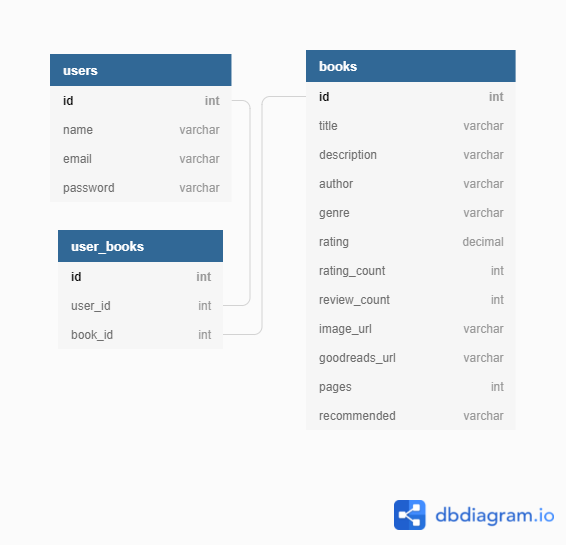

# 📚 The Chronicler

## Table of Contents
- [📚 The Chronicler](#-the-chronicler)
  - [Table of Contents](#table-of-contents)
  - [🔎 Overview](#-overview)
  - [💻 Technologies](#-technologies)
  - [🎨 Preview](#-preview)
  - [🌳 Table Associations](#-table-associations)

## 🔎 Overview
The Chronicler is an application that allows users to search through a database of books and add/remove them from their personal collection. This way, they are able to track what books are in their personal library.

## 💻 Technologies

|                       Technologies Used                        |
| :------------------------------------------------------------: |
|                             HTML5                              |
|                              CSS3                              |
|                         JavaScript ES6                         |
| [Handlebars](https://www.npmjs.com/package/express-handlebars) |
|              [ExpressJS](https://expressjs.com/)               |
|              [Sequelize](https://sequelize.org/)               |
|                [MySQL](https://www.mysql.com/)                 |
|            [Boostrap 5](https://getbootstrap.com/)             |
|                [NodeJS](https://nodejs.org/en/)                |
|               [SwiperJs](https://swiperjs.com/)                |
|         [scrollReveal.js](https://scrollrevealjs.org/)         |

## 🎨 Preview

## 🌳 Table Associations
